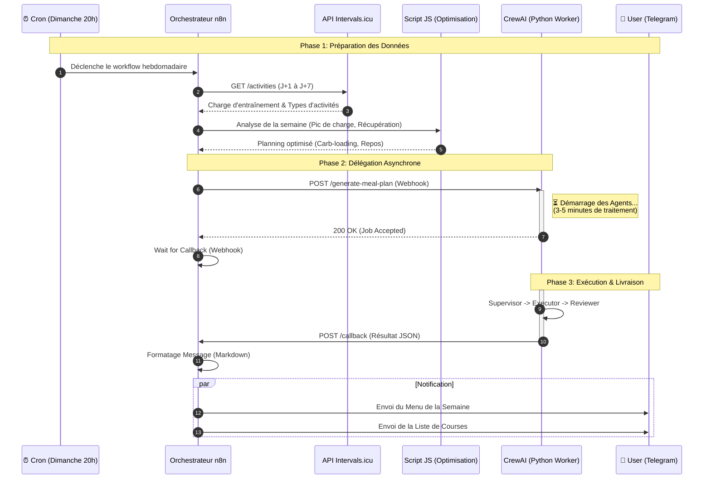

# Diagrammes pour l'article de blog Crew Meal

## 1. L'Architecture des Pipelines CrewAI

```mermaid
graph TD
    %% Styles
    classDef supervisor fill:#ffcc00,stroke:#333,stroke-width:2px,color:black
    classDef executor fill:#66ccff,stroke:#333,stroke-width:2px,color:black
    classDef reviewer fill:#99cc33,stroke:#333,stroke-width:2px,color:black
    classDef output fill:#f9f,stroke:#333,stroke-width:2px,color:black,shape:circle

    subgraph P1[Pipeline 1 : Analyse Nutritionnelle Hexis]
        direction TB
        A[HEXIS_DATA_SUPERVISOR<br/>Thinking Model<br/><i>(Stratégie & Planification)</i>]:::supervisor
        B[HEXIS_DATA_EXECUTOR<br/>GPT-4o/Haiku<br/><i>(Appels API Hexis)</i>]:::executor
        C[HEXIS_ANALYSIS_REVIEWER<br/>Analyste<br/><i>(Synthèse & Objectifs)</i>]:::reviewer

        A -->|Plan de récupération| B
        B -->|Données brutes| C
        C -->|Cibles Macros & Énergie| D((Sortie JSON)):::output
    end

    subgraph P2[Pipeline 2 : Génération de Repas]
        direction TB
        E[MEAL_PLANNING_SUPERVISOR<br/>Chef Créatif<br/><i>(Design Culinaire)</i>]:::supervisor
        F[INGREDIENT_VALIDATION_EXECUTOR<br/>GPT-4o-mini<br/><i>(Recherche Base de Données)</i>]:::executor
        G[MEAL_RECIPE_REVIEWER<br/>Contrôleur Mathématique<br/><i>(Calculs Macros Précis)</i>]:::reviewer

        E -->|Plan de Repas Théorique| F
        F -->|Ingrédients Validés (Passio)| G
        G -->|Menu Final Ajusté| H((Menu Final)):::output
    end

    D -.->|Input: Cibles Nutritionnelles| E
```

## 2. Le Flux d'Automation n8n



## 3. L'Infrastructure Secure (Meta-MCP)

```mermaid
graph LR
    %% Styles
    classDef agent fill:#e1f5fe,stroke:#01579b,stroke-width:2px,color:black
    classDef router fill:#fff9c4,stroke:#fbc02d,stroke-width:4px,color:black
    classDef server fill:#f3e5f5,stroke:#7b1fa2,stroke-width:2px,color:black
    classDef tool fill:#e8f5e9,stroke:#2e7d32,stroke-width:1px,color:black

    subgraph Clients [Clients CrewAI]
        A1[Agent Nutrition]:::agent
        A2[Agent Sport]:::agent
    end

    subgraph MetaMCP [🛡️ Meta-MCP Middleware]
        Router{Router de Sécurité<br/><i>(Auth & Filtering)</i>}:::router
    end

    subgraph Infrastructure [Infrastructure MCP Distribuée]
        direction TB

        subgraph S1 [Server: Nutrition]:::server
            T1[Hexis API]:::tool
            T2[Passio DB]:::tool
        end

        subgraph S2 [Server: Sport]:::server
            T3[Strava API]:::tool
            T4[Intervals.icu]:::tool
        end

        subgraph S3 [Server: Context]:::server
            T5[OpenWeather]:::tool
        end
    end

    %% Connexions
    A1 -->|API Key 'Nutrition'| Router
    A2 -->|API Key 'Sport'| Router

    Router -->|✅ Autorisé| S1
    Router -->|✅ Autorisé| S2
    Router -->|✅ Autorisé| S3

    %% Flux Logiques (liens invisibles pour le layout ou explicites pour la sécurité)
    linkStyle 0 stroke:#2e7d32,stroke-width:2px;
    linkStyle 1 stroke:#2e7d32,stroke-width:2px;

    %% Explication visuelle du filtrage
    Router -.->|❌ Bloqué (Scope)| T3
    Router -.->|❌ Bloqué (Scope)| T1
```
