# Diagrammes pour l'article de blog Crew Meal

## 1. L'Architecture des Pipelines CrewAI

```mermaid
graph TD
    %% Styles
    classDef supervisor fill:#ffcc00,stroke:#333,stroke-width:2px,color:black
    classDef executor fill:#66ccff,stroke:#333,stroke-width:2px,color:black
    classDef reviewer fill:#99cc33,stroke:#333,stroke-width:2px,color:black
    classDef output fill:#f9f,stroke:#333,stroke-width:2px,color:black,shape:circle

    subgraph P1[Pipeline 1 : Analyse Nutritionnelle Hexis]
        direction TB
        A[HEXIS_DATA_SUPERVISOR<br/>Thinking Model<br/><i>(Stratégie & Planification)</i>]:::supervisor
        B[HEXIS_DATA_EXECUTOR<br/>GPT-4o/Haiku<br/><i>(Appels API Hexis)</i>]:::executor
        C[HEXIS_ANALYSIS_REVIEWER<br/>Analyste<br/><i>(Synthèse & Objectifs)</i>]:::reviewer

        A -->|Plan de récupération| B
        B -->|Données brutes| C
        C -->|Cibles Macros & Énergie| D((Sortie JSON)):::output
    end

    subgraph P2[Pipeline 2 : Génération de Repas]
        direction TB
        E[MEAL_PLANNING_SUPERVISOR<br/>Chef Créatif<br/><i>(Design Culinaire)</i>]:::supervisor
        F[INGREDIENT_VALIDATION_EXECUTOR<br/>GPT-4o-mini<br/><i>(Recherche Base de Données)</i>]:::executor
        G[MEAL_RECIPE_REVIEWER<br/>Contrôleur Mathématique<br/><i>(Calculs Macros Précis)</i>]:::reviewer

        E -->|Plan de Repas Théorique| F
        F -->|Ingrédients Validés (Passio)| G
        G -->|Menu Final Ajusté| H((Menu Final)):::output
    end

    D -.->|Input: Cibles Nutritionnelles| E
```

## 2. Le Flux d'Automation n8n

```mermaid
sequenceDiagram
    autonumber
    participant Cron as ⏰ Cron (Dimanche 20h)
    participant N8N as Orchestrateur n8n
    participant Intervals as API Intervals.icu
    participant Logic as Script JS (Optimisation)
    participant Crew as CrewAI (Python Worker)
    participant Telegram as 📱 User (Telegram)

    Note over Cron, Telegram: Phase 1: Préparation des Données
    Cron->>N8N: Déclenche le workflow hebdomadaire
    N8N->>Intervals: GET /activities (J+1 à J+7)
    Intervals-->>N8N: Charge d'entraînement & Types d'activités
    N8N->>Logic: Analyse de la semaine (Pic de charge, Récupération)
    Logic-->>N8N: Planning optimisé (Carb-loading, Repos)

    Note over N8N, Crew: Phase 2: Délégation Asynchrone
    N8N->>Crew: POST /generate-meal-plan (Webhook)
    activate Crew
    Note right of Crew: ⏳ Démarrage des Agents...<br/>(3-5 minutes de traitement)
    Crew-->>N8N: 200 OK (Job Accepted)
    deactivate Crew
    N8N->>N8N: Wait for Callback (Webhook)

    Note over Crew, Telegram: Phase 3: Exécution & Livraison
    activate Crew
    Crew->>Crew: Supervisor -> Executor -> Reviewer
    Crew->>N8N: POST /callback (Résultat JSON)
    deactivate Crew

    N8N->>N8N: Formatage Message (Markdown)
    par Notification
        N8N->>Telegram: Envoi du Menu de la Semaine
        N8N->>Telegram: Envoi de la Liste de Courses
    end
```



## 3. L'Infrastructure Secure (Meta-MCP)

```mermaid
graph LR
    %% Styles
    classDef agent fill:#e1f5fe,stroke:#01579b,stroke-width:2px,color:black
    classDef router fill:#fff9c4,stroke:#fbc02d,stroke-width:4px,color:black
    classDef server fill:#f3e5f5,stroke:#7b1fa2,stroke-width:2px,color:black
    classDef tool fill:#e8f5e9,stroke:#2e7d32,stroke-width:1px,color:black

    subgraph Clients [Clients CrewAI]
        A1[Agent Nutrition]:::agent
        A2[Agent Sport]:::agent
    end

    subgraph MetaMCP [🛡️ Meta-MCP Middleware]
        Router{Router de Sécurité<br/><i>(Auth & Filtering)</i>}:::router
    end

    subgraph Infrastructure [Infrastructure MCP Distribuée]
        direction TB

        subgraph S1 [Server: Nutrition]:::server
            T1[Hexis API]:::tool
            T2[Passio DB]:::tool
        end

        subgraph S2 [Server: Sport]:::server
            T3[Strava API]:::tool
            T4[Intervals.icu]:::tool
        end

        subgraph S3 [Server: Context]:::server
            T5[OpenWeather]:::tool
        end
    end

    %% Connexions
    A1 -->|API Key 'Nutrition'| Router
    A2 -->|API Key 'Sport'| Router

    Router -->|✅ Autorisé| S1
    Router -->|✅ Autorisé| S2
    Router -->|✅ Autorisé| S3

    %% Flux Logiques (liens invisibles pour le layout ou explicites pour la sécurité)
    linkStyle 0 stroke:#2e7d32,stroke-width:2px;
    linkStyle 1 stroke:#2e7d32,stroke-width:2px;

    %% Explication visuelle du filtrage
    Router -.->|❌ Bloqué (Scope)| T3
    Router -.->|❌ Bloqué (Scope)| T1
```
